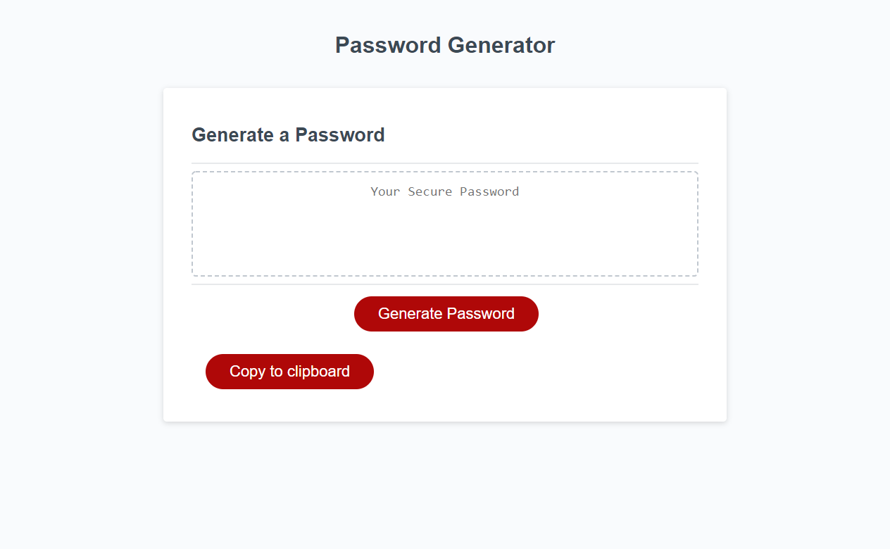

# password-generator
modify starter code to make a functional password generator

##Live Installation:

https://silversssc.github.io/password-generator/

##List of used technology:
HTML5
CSS

## Installation

Use git clone to clone this repository to your local drive

'''bash
git clone "insert repo"
'''

## References
copy to clipboard button tutorial: https://www.youtube.com/watch?v=duNmhKgtcsI

## Contributing
Pull requests are welcome. For major changes, please open an issue first to discuss what you would like to change.

Please make sure to update tests as appropriate.

## License
[MIT](https://choosealicense.com/licenses/mit/)
